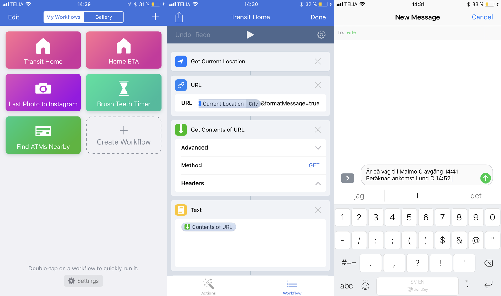

# Motivation

My wife texts me everyday asking which commuter train I'll be taking home from work. When I heard about [Workflow](https://workflow.is/) for iOS I thought I could use it to get one step ahead.

I tried to use the built in "Home ETA" which uses Google maps but eventually decided to make my own workflow which talks directly to [Skånetrafiken API](http://www.labs.skanetrafiken.se/api.asp). Given that the app doesnt work well with XML parsing I needed to create this repository which acts as a BFF/backend-for-frontend. Ultimatly I put most of the workflow tasks right into this small node server so that I could skip message formatting in the workflow app. 

I have a server running it, you can get the super stable production URL if you ask for it if you want to use it.

Current location/city name is passed from workflow as query string parameter to the URL and the server can respond with a JSON object or a formatted message. Basic support of delays but currently doesnt support cancelled departures. 

